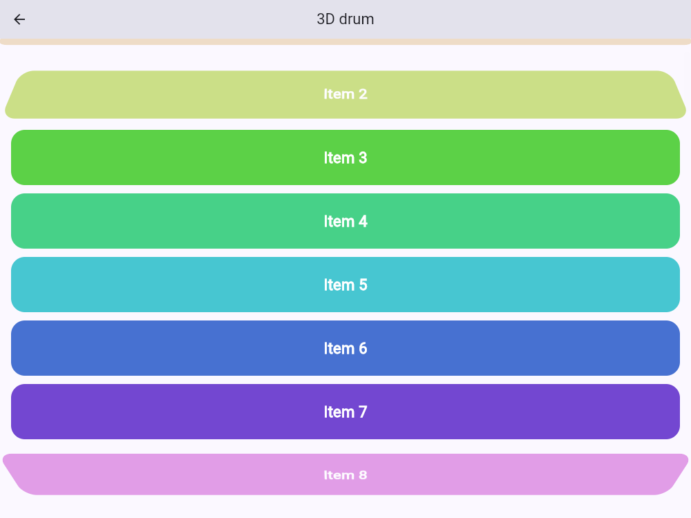
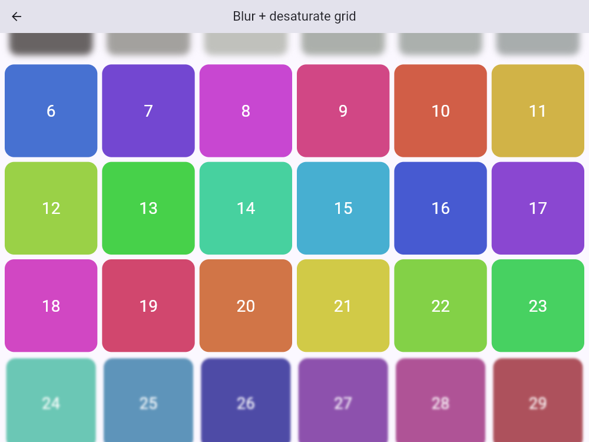

# scroll_transition

SwiftUI's `.scrollTransition` and `.visualEffect` for Flutter. List, grid
and page items fade, scale, rotate, tilt in 3D, blur, slide or desaturate
based on where they are in the scroll viewport. The effects are applied at
paint time, so **nothing is rebuilt while you scroll**.

Solves [flutter/flutter#128870](https://github.com/flutter/flutter/issues/128870)
("scrollTransition / visualEffect equivalent", marked *would be a good
package*). The closest existing package, `visual_effect`, is experimental
and has not been updated since 2023.

```dart
ListView.builder(
  itemBuilder: (context, i) => ScrollTransition(
    effect: ScrollEffects.fade().scale(0.8),
    child: Card(child: ListTile(title: Text('Item $i'))),
  ),
)
```

| `rotate3D().fade()` on a ListView | `blur(6).saturate(0)` on a GridView |
|:-:|:-:|
|  |  |

## Install

```yaml
dependencies:
  scroll_transition: ^0.1.0
```

```dart
import 'package:scroll_transition/scroll_transition.dart';
```

## The phase

Each `ScrollTransition` measures its own rect against the nearest scroll
viewport every frame and turns it into a `ScrollTransitionPhase`:

| value | `kind` | meaning |
|---|---|---|
| `-1` | `topLeading` | fully past the top (vertical) or leading (horizontal) edge |
| `-1 < v < 0` | `topLeading` | crossing the top/leading edge |
| `0` | `identity` | fully inside the viewport (or the inset region) |
| `0 < v < 1` | `bottomTrailing` | crossing the bottom/trailing edge |
| `1` | `bottomTrailing` | fully past the bottom/trailing edge |

Like SwiftUI, the edges are in **screen space**: "top" is the physical
top, and "leading" is left in LTR and right in RTL. `reverse: true` does
not flip them. `topInset` and `bottomInset` shrink the identity region,
for example to fade items as they slide under a pinned header.

## Usage

### Ready-made effects (zero rebuilds)

```dart
ScrollTransition(
  effect: ScrollEffects.fade(),              // opacity 1 -> 0
  child: tile,
)

ScrollEffects.scale(0.8)                     // 1 -> 0.8
ScrollEffects.rotate(math.pi / 12)           // 2D, opposite at each edge
ScrollEffects.rotate3D(angle: math.pi / 4)   // edge recedes like a drum
ScrollEffects.blur(8)                        // Gaussian sigma 0 -> 8
ScrollEffects.slide(48)                      // moves away from the centre
ScrollEffects.translate(Offset(80, 0))       // same direction at both edges
ScrollEffects.saturate(0)                    // towards greyscale
ScrollEffects.custom((phase) => VisualEffectValues(
  opacity: phase.isIdentity ? 1 : 0.4,
))
```

Chain them. Each chained method has the same name as its factory:

```dart
ScrollEffects.fade(0.2).scale(0.9).blur(4).slide(24)
ScrollEffects.fade().then(myOtherEffect)
```

### Interactive vs animated

```dart
// Default: follows the scroll continuously, optionally reshaped by a curve.
configuration: const ScrollTransitionConfiguration.interactive(curve: Curves.easeIn),

// Snaps between -1 / 0 / 1 once `threshold` of the item is visible,
// animating each change.
configuration: const ScrollTransitionConfiguration.animated(
  duration: Duration(milliseconds: 350),
  curve: Curves.easeOutBack,
  threshold: 0.5,
),
```

With `.animated`, an item that first appears below the threshold starts at
its edge phase without animating, then animates in once it crosses the
threshold.

### Builder: arbitrary widgets from the phase

```dart
ScrollTransition(
  builder: (context, child, phase) => Stack(children: [
    child!,
    Text(phase.kind.name),
  ]),
  child: const ExpensiveTile(),   // never rebuilt by the transition
)
```

The builder reruns **only when the phase changes**. Items fully inside the
viewport are not rebuilt while scrolling. You can pass `effect` and
`builder` together.

### VisualEffect: effects from raw geometry

```dart
VisualEffect(
  effect: (g) {
    final d = g.centerOffset.clamp(-1.0, 1.0);   // -1..1 from viewport centre
    return VisualEffectValues(scale: 1 - 0.25 * d.abs(), rotationY: -0.6 * d);
  },
  child: card,
)
```

`VisualEffectGeometry` gives you `rect` (in viewport coordinates),
`viewportSize`, `axisDirection`, `textDirection`, `hasViewport`,
`leadingOffset`, `visibleFraction`, `centerOffset` and `phase(...)`.
`VisualEffect(builder: (context, child, geometry) => ...)` is the rebuild
variant. Geometry changes on every scroll frame, so prefer `effect:`.

## Supported scroll views

`ListView`, `GridView`, `CustomScrollView` slivers (including pinned
`SliverPersistentHeader`s), `PageView` and `SingleChildScrollView`. They
work vertical or horizontal, `reverse: true`, LTR or RTL, with keep-alive
children and nested scrollables (the phase is always relative to the
*nearest* scrollable). Outside any scrollable the phase is identity.

## Platform support

| Android | iOS | Web | macOS | Windows | Linux |
|:-:|:-:|:-:|:-:|:-:|:-:|
| ✅ | ✅ | ✅ | ✅ | ✅ | ✅ |

Pure Dart. No platform channels.

## How it works

`RenderVisualEffect` (a `RenderProxyBox`) listens to the scroll position
and marks itself for **repaint**, not rebuild or relayout, when the
position changes. During paint it measures `getTransformTo(viewport)`,
resolves the effect and paints the child through reused transform,
opacity, colour-filter and image-filter layers. Hit testing follows the
painted transform.

The builder path predicts the new geometry the moment the scroll offset
changes (before the frame builds), using the item's measured movement
ratio. That way it rebuilds in the same frame, and the paint pass
corrects any error.

## Limitations

- **Builder mode, first appearance:** an item painted for the first time
  (for example, scrolled in from the cache extent) is skipped for exactly
  one frame, so it is never shown with a stale phase. `effect:` mode has
  no such frame.
- **Builder mode, pinned/floating content:** until the item's movement
  ratio is learned (after its first scroll frame), the prediction can be
  one frame off. `effect:` mode is always exact.
- **Moves without a scroll:** if an item moves inside the viewport without
  the scroll offset changing and without being repainted (for example, a
  sibling above resizes while the item sits behind the list's
  RepaintBoundary), the phase updates on the next scroll or repaint.
- **Two-dimensional scroll views:** only the nearest scrollable's axis is
  considered.
- **Blur cost:** blur uses an image filter per item. Keep sigma modest in
  long lists on low-end devices.
- Effects are visual only. They never change layout, as in SwiftUI.

## Verified on device

`example/integration_test/visual_effects_test.dart` launches the real
example app (`flutter test integration_test -d macos`), scrolls five demos
to known offsets, checks the painted opacity, scale, tilt, blur and
carousel transforms against the measured phase, and saves in-app
screenshots. The images in `screenshots/` come from that run and from
headless Chrome driving the web build.

## Example

`example/` has a catalogue covering fade and scale, a 3D drum, a blurred
and desaturated grid, a VisualEffect carousel with an RTL toggle, a
PageView, a reversed chat, the animated configuration, builder mode, a
pinned header with `topInset`, nested rows with keep-alive, and a live
geometry readout.

## License

MIT © 2026 Manish Kumar Panday
